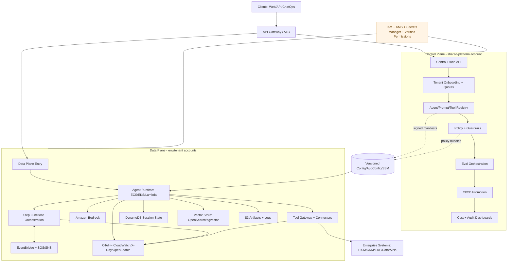

# Enterprise Agentic AI Platform on AWS

Practical, implementation-focused reference for building an enterprise-grade, multi-tenant agentic AI platform on AWS.

## What’s in this repo

- `docs/aws-agentic-platform-architecture.md` — full architecture standard
- `docs/one-page-architecture.md` — bootstrap quickstart with 1-page Mermaid diagram
- `docs/deployment-blueprint-v1.md` — executable rollout checklist

## 1-Page Architecture Diagram (Mermaid)

## MVP vs Scale Implementation Matrix

| Capability | MVP Baseline | Scale/Enterprise Target |
|---|---|---|
| Runtime | Lambda/ECS single-agent | EKS/ECS multi-agent pools |
| Orchestration | Step Functions (single flow) | Step Functions + EventBridge choreography |
| Memory | DynamoDB + S3 | DynamoDB + Vector DB + S3 lifecycle tiers |
| Tooling | Small connector set | Tool gateway with risk tiers and approvals |
| Tenancy | Shared account + logical partitioning | Env isolation + selective account-per-tenant |
| Governance | IAM + basic guardrails | Central policy-as-code + approval workflows |
| Observability | CloudWatch logs/metrics | OTel traces + eval dashboards + SLO alerts |
| Release | CI pipeline + manual prod approval | Full eval gates + canary + rollback automation |

## Notes on AgentCore / Strands

This repo is capability-first. If AgentCore/Strands features are available and mature in your AWS environment, map them in as accelerators. If not, the documented AWS-native baseline remains fully viable.

## Additions in this revision
- Agent-to-agent authentication pattern (IAM/IRSA + SigV4 signed envelopes)
- Explicit observability vs immutable auditing split
- Terraform-first module/workspace delivery model
- Lambda-first to ROSA-scale runtime migration path
- Layered prompt/security inheritance model (`base-policy-pack` -> `domain-pack` -> `agent-intent-pack`)
