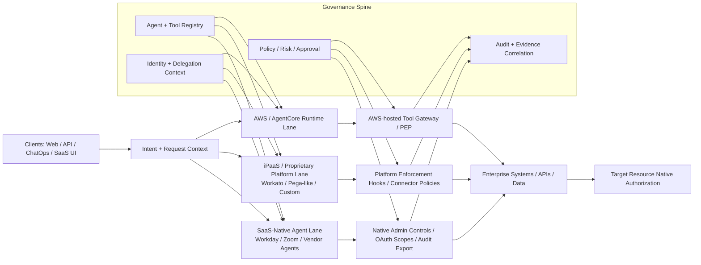

# Enterprise Agentic AI Platform on AWS

Practical, implementation-focused reference for governing and deploying enterprise agentic AI across AWS/AgentCore, iPaaS/proprietary automation platforms, and SaaS-native agent surfaces.

## What’s in this repo

Current AgentCore prototype authority:
- `docs/agentcore-prototype-spec-v1.md` — current authoritative prototype spec/draft
- `docs/agentcore-repo-reconciliation-v1.md` — reconciliation notes for stale or misaligned repo artifacts

Architecture and implementation docs:
- `docs/aws-agentic-platform-architecture.md` — full architecture standard reconciled to the current prototype direction
- `docs/one-page-architecture.md` — bootstrap quickstart with 1-page Mermaid diagram
- `docs/agentcore-capabilities-implementation-guide.md` — implementation guide for AgentCore Runtime plus cross-platform governance
- `docs/deployment-blueprint-v1.md` — executable rollout checklist
- `docs/autonomy-levels-overview.md` — public-facing autonomy model one-pager
- `docs/autonomy-action-taxonomy-risk-classes-v1.md` — detailed action taxonomy, risk classes, and lane mapping
- `docs/acp-*.md` — implementation annex drafts for policy gateway, approvals, audit propagation, and validation

## Core Position

The architecture anchors on **one logical governance spine, multiple enforcement points**.

That means policy, identity context, approval routing, audit correlation, and registry ownership should be standardized across the enterprise. It does **not** mean every agent or tool action must be forced through one vendor product gateway.

Workato or another iPaaS can be a strong mediated integration plane where it has the right connector coverage and controls. It should not be declared the universal gateway because of organizational preference alone.

## 1-Page Architecture Diagram (Mermaid)

```mermaid
flowchart LR
    C[Clients: Web / API / ChatOps / SaaS UI] --> INTENT[Intent + Request Context]

    subgraph GOV[Governance Spine]
      REG[Agent + Tool Registry]
      POL[Policy / Risk / Approval]
      AUD[Audit + Evidence Correlation]
      ID[Identity + Delegation Context]
    end

    INTENT --> AWSLANE[AWS / AgentCore Runtime Lane]
    INTENT --> IPAAS[iPaaS / Proprietary Platform Lane\nWorkato / Pega-like / Custom]
    INTENT --> SAAS[SaaS-Native Agent Lane\nWorkday / Zoom / Vendor Agents]

    AWSLANE --> GW[AWS-hosted Tool Gateway / PEP]
    IPAAS --> IPAASGW[Platform Enforcement Hooks / Connector Policies]
    SAAS --> SAASCTRL[Native Admin Controls / OAuth Scopes / Audit Export]

    REG --> AWSLANE
    REG --> IPAAS
    REG --> SAAS
    ID --> AWSLANE
    ID --> IPAAS
    ID --> SAAS
    POL --> GW
    POL --> IPAASGW
    POL --> SAASCTRL
    GW --> AUD
    IPAASGW --> AUD
    SAASCTRL --> AUD

    GW --> SYS[Enterprise Systems / APIs / Data]
    IPAASGW --> SYS
    SAASCTRL --> SYS
    SYS --> AUTHZ[Target Resource Native Authorization]
```

## MVP vs Scale Implementation Matrix

| Capability | MVP Baseline | Scale/Enterprise Target |
|---|---|---|
| Agent topology | Single bounded-purpose domain agent | Multi-agent orchestration only where justified |
| Runtime | AgentCore Runtime or application/framework agent | Multiple runtime classes with same governance contract |
| Orchestration | Code-first workflow logic; durable checkpoints as needed | Code-first orchestration + Step Functions/EventBridge where useful |
| Tooling | Registered tool/action contracts | Cross-platform action registry and tiered enforcement |
| External platforms | Inventory + control-tier assignment | Policy/audit integration across AWS, iPaaS, proprietary, and SaaS-native lanes |
| Governance | Policy/risk/approval/audit spine | Portable governance contract across multiple enforcement points |
| Identity | Entra/federated identity + explicit delegation mode | Delegated authorization preservation or documented service-account exceptions |
| Observability | Runtime telemetry + audit evidence | OTel/SLOs + immutable audit correlation across platforms |
| Release | CI/eval gates + manual prod approval | Full eval/security/policy gates + canary + rollback automation |

## Workato / iPaaS Note

Workato may be a Tier 1 mediated integration plane. It is not automatically the enterprise Gateway.

Use Workato when it improves connector coverage and preserves policy, identity, approval, idempotency, and audit controls. Avoid forcing Workato into the path when it weakens delegated authorization, obscures target-resource authorization, cannot front SaaS-native agents, or becomes an operational choke point.

## Additions in this revision

- Authoritative AgentCore prototype spec linked from repo entry point
- External agent/action-surface inventory requirement
- Integration control tiers for AWS, iPaaS/proprietary, SaaS-native, and legacy exception paths
- Workato/iPaaS position anchored on technical control fit rather than organizational preference
- Single-domain-agent-first posture
- Code-first orchestration with AgentCore Runtime as managed hosting plane
- Delegated authorization and audit-correlation requirements across platforms
