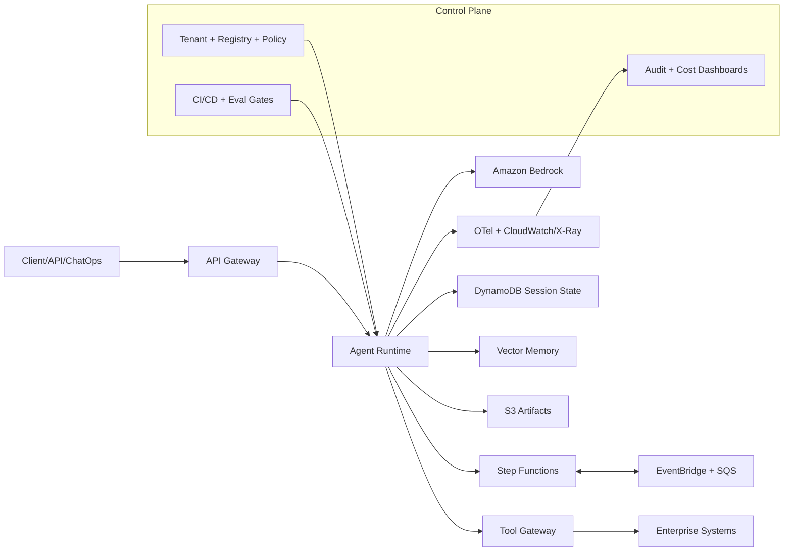

# One-Page Architecture Bootstrap

## Goal
Give implementation teams a no-fluff starting map for standing up an enterprise agentic platform in AWS.

## Architecture Diagram

## Build Order (Minimal)
1. Runtime contract + single-agent endpoint
2. Step Functions orchestration skeleton
3. Bedrock invocation policy + budget limits
4. Tool gateway with schema + risk class
5. Session state + artifacts
6. Telemetry + alarms
7. CI/CD promotion gates
