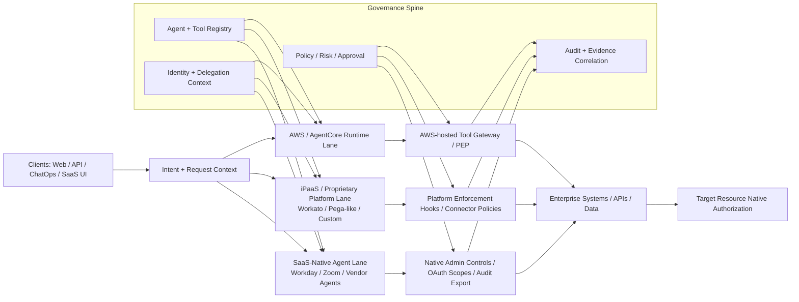

# One-Page Architecture Bootstrap

## Goal

Give implementation teams a no-fluff starting map for governing enterprise agents across AWS-hosted runtimes, iPaaS/proprietary automation platforms, and SaaS-native agent surfaces.

The key idea: build one **logical governance spine**, not one product-shaped choke point.

## Architecture Diagram

```mermaid
flowchart LR
    C[Clients: Web / API / ChatOps / SaaS UI] --> INTENT[Intent + Request Context]

    subgraph GOV[Governance Spine]
      REG[Agent + Tool Registry]
      POL[Policy / Risk / Approval]
      AUD[Audit + Evidence Correlation]
      ID[Identity + Delegation Context]
    end

    INTENT --> AWSLANE[AWS / AgentCore Runtime Lane]
    INTENT --> IPAAS[iPaaS / Proprietary Platform Lane\nWorkato / Pega-like / Custom]
    INTENT --> SAAS[SaaS-Native Agent Lane\nWorkday / Zoom / Vendor Agents]

    AWSLANE --> GW[AWS-hosted Tool Gateway / PEP]
    IPAAS --> IPAASGW[Platform Enforcement Hooks / Connector Policies]
    SAAS --> SAASCTRL[Native Admin Controls / OAuth Scopes / Audit Export]

    REG --> AWSLANE
    REG --> IPAAS
    REG --> SAAS
    ID --> AWSLANE
    ID --> IPAAS
    ID --> SAAS
    POL --> GW
    POL --> IPAASGW
    POL --> SAASCTRL
    GW --> AUD
    IPAASGW --> AUD
    SAASCTRL --> AUD

    GW --> SYS[Enterprise Systems / APIs / Data]
    IPAASGW --> SYS
    SAASCTRL --> SYS
    SYS --> AUTHZ[Target Resource Native Authorization]
```

## Build Order (Minimal)

1. Inventory in-scope agents and agent-like automations across AWS, iPaaS/proprietary platforms, and SaaS-native surfaces.
2. Assign each action surface a control tier:
   - Tier 0: platform-owned runtime/tool gateway
   - Tier 1: mediated iPaaS/proprietary platform
   - Tier 2: SaaS-native/constrained vendor surface
   - Tier 3: legacy/manual exception
3. Standardize request context: user, agent, tenant/business context, environment, trace/run IDs, delegation mode, approval state.
4. Register tool/action contracts with risk class, identity mode, approval requirements, and audit obligations.
5. Implement policy and approval enforcement at every feasible enforcement point.
6. Capture native SaaS/admin audit evidence where full front-door gatewaying is impossible.
7. Validate delegated authorization and target-resource native authorization before calling a use case production-ready.

## Workato / Gateway Note

Workato can be an important mediated integration plane, but it should not be assumed to be the universal enterprise agent gateway. The durable architecture is the portable governance spine: policy, identity context, approval routing, and audit correlation that can be implemented across multiple enforcement points.
